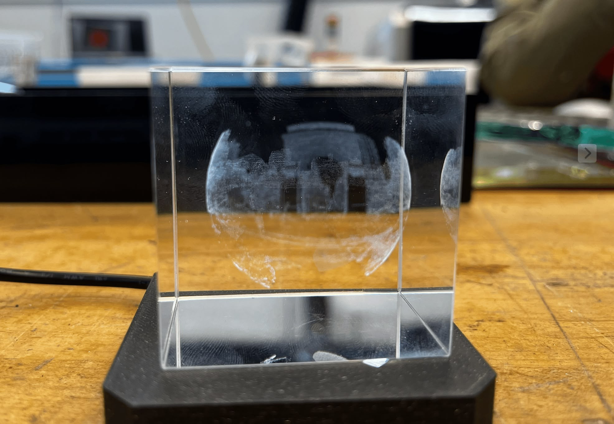
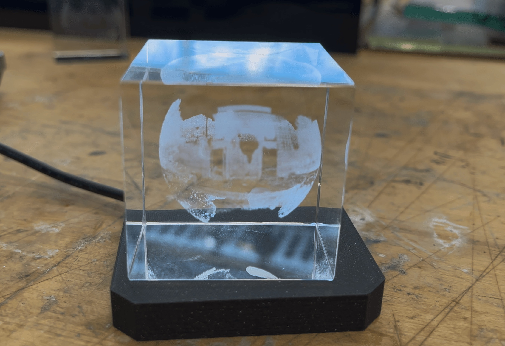

# pano2points

Convert Google Street View panoramas to dithered point clouds for subsurface laser engraving.

## Project Showcase

Engraved Washington Square Park (NYC) panorama inside K9 crystal using an [xTool F2 Ultra UV laser](https://www.xtool.com/products/xtool-f2-ultra-60w-mopa-40w-diode-dual-laser-engraver?srsltid=AfmBOoqMkQ88YfzNeUakmWhsAcRZ5apIH7uuYaBpR1aWdtui5G5m7yqY).

| Zoom 2 (2048×1024, ~158k points)          | Zoom 3 (4096×2048, ~630k points)          |
| ----------------------------------------- | ----------------------------------------- |
|  |  |

---

## Quick Start

```bash
# 1. Download panorama from Washington Square Park (auto-leveled)
uv run scripts/download_washington_square.py data/washington_square.jpg --zoom 3

# 2. Generate point cloud (brightness filter removes sky)
uv run pano2points data/washington_square.jpg --max-size 8000 -r 25 --brightness-max 0.6
```

The `--brightness-max 0.6` filter excludes bright pixels (the sky), keeping only the darker parts of the scene (buildings, trees, ground).

### Zoom Levels & Point Counts

| Zoom | Resolution | Points |
| ---- | ---------- | ------ |
| 2    | 2048×1024  | ~158k  |
| 3    | 4096×2048  | ~630k  |
| 4    | 8192×4096  | ~2.4M  |

---

## Installation

Requires Python 3.12+ and [uv](https://docs.astral.sh/uv/).

```bash
git clone https://github.com/yz3440/pano2points.git
cd pano2points
uv sync
```

---

## Downloading Street View Panoramas

Download panoramas directly from Google Street View with automatic horizon leveling:

```bash
uv run scripts/download_washington_square.py [output_path] [options]
```

### Options

| Option       | Description                                                                          |
| ------------ | ------------------------------------------------------------------------------------ |
| `--zoom N`   | Resolution level 0-5 (0=512×256, 3=4096×2048, 4=8192×4096, 5=16384×8192). Default: 3 |
| `--no-level` | Skip auto-leveling (keep original camera tilt)                                       |

```bash
# High resolution (8192×4096)
uv run scripts/download_washington_square.py data/wsq.jpg --zoom 4

# Raw image without leveling
uv run scripts/download_washington_square.py data/wsq_raw.jpg --no-level
```

The script automatically:

- Fetches a specific panorama by ID (`eKHNUWxhdsVMzC9kQyaNuQ`)
- Detects camera pitch and roll from Google's metadata
- Applies spherical rotation to level the horizon
- Saves metadata as JSON alongside the image

---

## Point Cloud Generation

Convert panoramas to dithered point clouds for 3D subsurface laser engraving.

```bash
uv run pano2points <input_image> [options]
```

### Options

| Option             | Default       | Description                                  |
| ------------------ | ------------- | -------------------------------------------- |
| `-o, --output`     | `<input>.ply` | Output file (.ply or .xyz)                   |
| `-r, --radius`     | `50.0`        | Sphere radius (mm)                           |
| `--max-size`       | `2000`        | Max image dimension (controls point density) |
| `--invert`         | off           | Dark areas become points instead of bright   |
| `--rotate-x`       | `0`           | Rotation around X axis (degrees)             |
| `--rotate-y`       | `0`           | Rotation around Y axis (degrees)             |
| `--rotate-z`       | `0`           | Rotation around Z axis (degrees)             |
| `--height-min`     | `0.0`         | Min height fraction (0=bottom, 1=top)        |
| `--height-max`     | `1.0`         | Max height fraction (0=bottom, 1=top)        |
| `--brightness-min` | `0.0`         | Min source brightness to include (0-1)       |
| `--brightness-max` | `1.0`         | Max source brightness to include (0-1)       |
| `--preview`        | off           | Save dithered image preview                  |

Rotation is applied **before** height filtering, so you can rotate the sphere then slice it.
Brightness filtering uses the **original** pixel brightness (before dithering).

### Examples

```bash
# Basic conversion (bright areas = points)
uv run pano2points panorama.jpg

# Inverted for dark subject on light background
uv run pano2points panorama.jpg --invert

# Higher density (more points)
uv run pano2points panorama.jpg --max-size 4000

# Rotate sphere 90° around X, then take top half
uv run pano2points panorama.jpg --rotate-x 90 --height-min 0.5

# Only include pixels darker than 60% brightness (filters out sky)
uv run pano2points panorama.jpg --brightness-max 0.6

# Export as XYZ instead of PLY
uv run pano2points panorama.jpg -o output.xyz
```

### How It Works

1. Load and resize image to max dimension
2. Apply Floyd-Steinberg dithering (grayscale → binary)
3. Filter points by original brightness threshold
4. Map selected pixels to spherical coordinates
5. Export as PLY or XYZ point cloud

---

## Units

Point cloud files are unitless. Most 3D software interprets values as **millimeters**:

- `--radius 25` → 25mm radius, 50mm diameter sphere

Scale on import if your software uses different units.

---

## License

MIT
